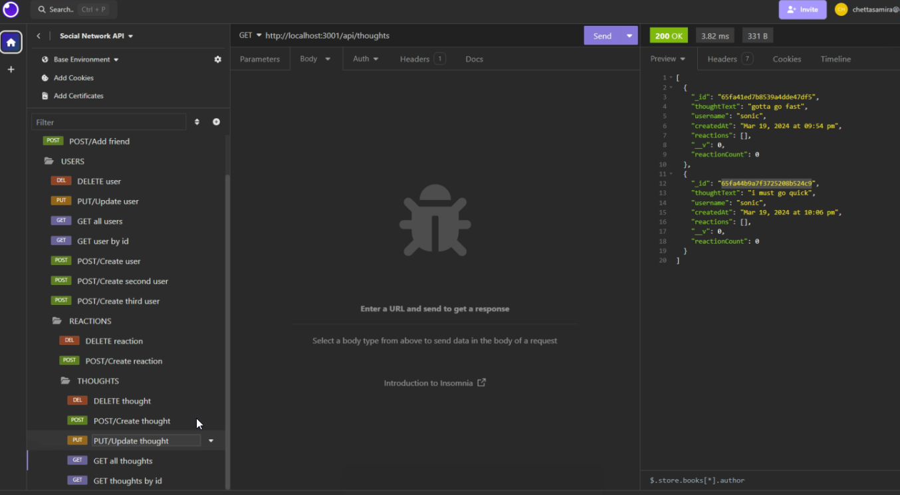
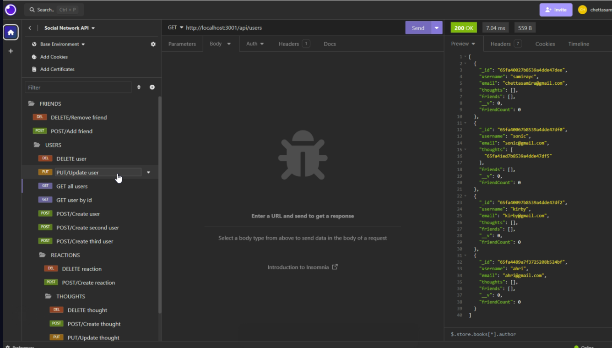
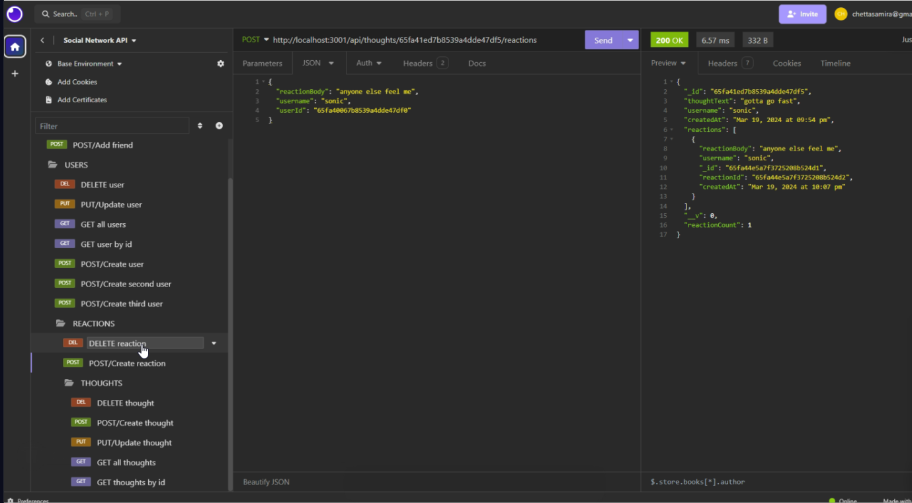
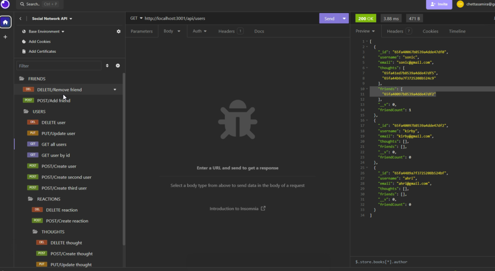

# Social Network API

## Description
An API for a social network web app where users can add friends, create thoughts, react to others' thoughts, and more.

## Table of Contents

* [Demo](#demo)
* [Installation](#installation)
* [Usage](#usage)
* [Technologies](#technologies)

## Demo

View the full demo [here](https://drive.google.com/file/d/1UVP3Wx6KyB7xTmPEFwj0kv_GpoA4p7Vr/view?usp=sharing)

Examples:

Get all thoughts

Get all users

Get reaction

Add friend

## Installation

* Clone this repository to run on your local machine
* Must have `Node.js` and `MongoDB` installed to use this application

## Usage
* Run `npm i` to install necessary dependencies
* Run `npm start` or `node server.js` to run the application

## Technologies
* Javascript
* Express.js
* Node.js
* MongoDB
* Mongoose
* Insomnia
* Moment.js